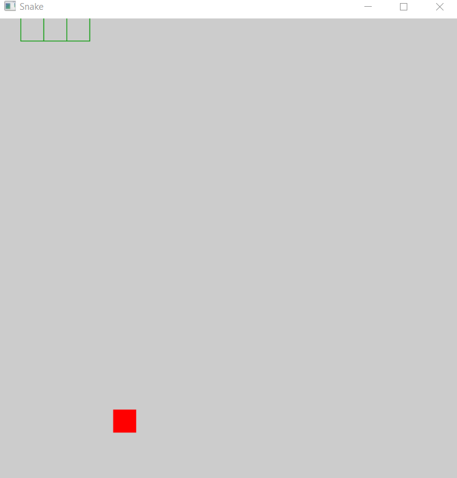

# haskell-snake

Snake game made with Haskell

To run it locally, you need to: 

1. [Download haskell platform](https://www.haskell.org/platform/)
2. Clone the repo
3. run the command: `cabal sandbox init`
4. run the command: `cabal install`
5. run the command: `cabal run`

